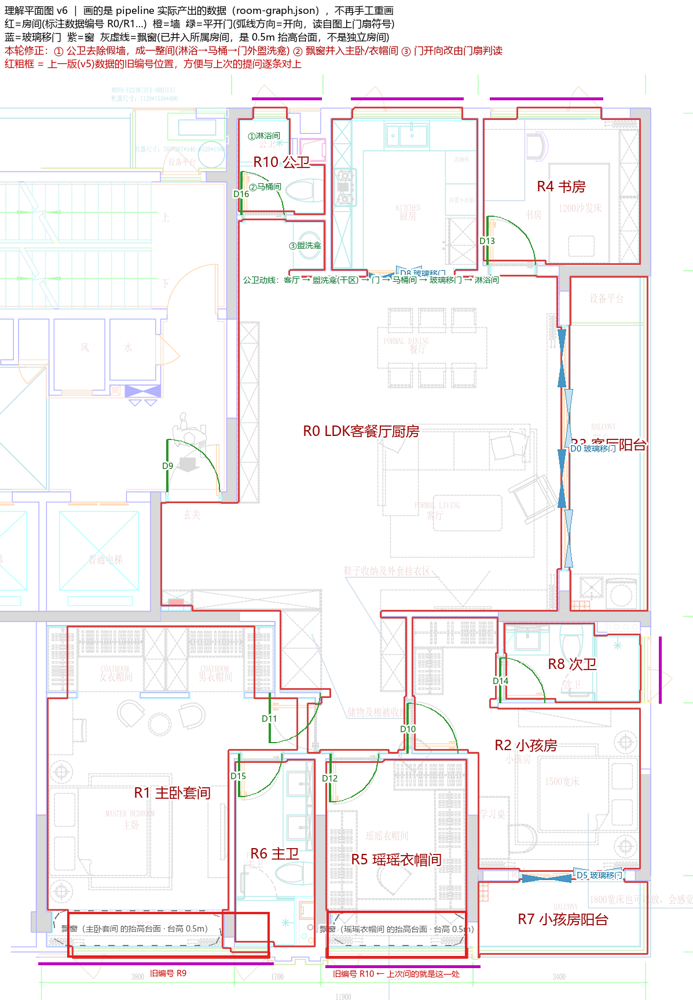
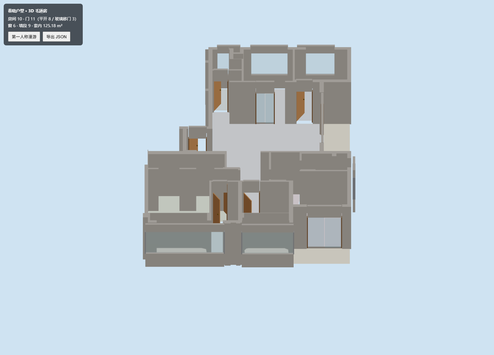

# 春晓户型 · 矢量 PDF → 3D 毛坯房

把 CAD 导出的**矢量 PDF 平面图**重建为一间**严格正交**的可交互 3D 毛坯房，
并且每一步都留下**可复核的中间产物**（数据 + 判读图），而不是"出个模型就完事"。



## 它解决什么

CAD 出的 PDF 保留了完整的 OCG 图层语义（`P-WALL` / `P-DOOR` / `COMM-GLAZ-SECT` …），
但这些图元**不能直接当几何用**：

- 门扇符号画在**开启位置**，当墙用就会在房间里切出一条**假墙**；
- 柱墙层的**斜向填充线**会把"严格正交"的户型污染成满屏斜边；
- 飘窗与房间之间只有**窗台边线**，不是墙；公卫旁的**管井**不是可用空间；
- 窗户 / 阳台的玻璃移门与平开门混在同一图层，得靠**图元形态**区分。

本项目逐个把这些坑填掉，并把**判读歧义处的裁定**显式写进代码
（`pipeline/geom_v6.py` 顶部的「人工裁定表」，每条注明 PDF 依据）。

## 结果

| 指标 | 值 |
|------|-----|
| 房间 | 10 |
| 门 | 11（平开 8 + 玻璃移门 3） |
| 窗 | 6 |
| 套内面积 | 125.18 m² |
| 非轴向边 | **0**（不是"轴率 93%"） |



## 快速开始

```bash
PY="C:/Users/super/.workbuddy/binaries/python/envs/default/Scripts/python.exe"   # 换成你的解释器

$PY pipeline/geom_v6.py            # 1. 重建 room-graph / walls_poly / roof_poly
$PY pipeline/triangulate_walls.py  # 2. 墙体 CDT 预三角化
$PY pipeline/make_plan6.py full    # 3. 出「理解平面图」（full|master|gw）

cd app && npm install && npx vite  # 4. 打开 3D，俯视 ↔ 第一人称漫游
```

3D 视角参数：`?zoom=` `?cx=&cy=` `?tilt=`（0 正俯视 / >0 轴测）、
`?mode=walk`（第一人称）、`?debug=wall|door|floor`（单层诊断）。

## 管线

```
chunxiao.pdf
   │
   ├─[1] 墙掩膜        P-WALL / COMM-WALL / 柱墙层，**轴向过滤**（正交性的根本保证）
   ├─[2] 户型包络      结构外皮 → 1D 核形态学闭合 → 填外轮廓（剔除邻户/公摊）
   ├─[3] 洞口反推      门扇 bbox 四侧探针扫墙 → 洞口线段；玻璃剖线 → 窗
   ├─[4] 房间分割      free = (barrier==0) & (envelope>0) → 连通域 → 贴旧房间名
   ├─[5] 矢量化        CHAIN_APPROX_NONE + 对角阶梯 L 形展开（边数 1020 → 368）
   └─[6] 写盘          room-graph.json / walls_poly.json / roof_poly.json
```

再经 `triangulate_walls.py` 做 Shewchuk CDT，前端顶面走三角网、侧壁走轮廓拉伸，
**绕开 three.js 的 earcut**（它在极瘦凹多边形上会产出穿透墙体的黑三角）。

## 判读可视化（不只是出模型）

| 工具 | 用途 |
|------|------|
| `make_plan6.py` | 把**管线实际产出的数据**画到 PDF 底图上，每个房间标 id，用于人眼核对 |
| `probe_region2.py X0 Y0 X1 Y1` | 列出 ROI 内所有矢量图元（图层/颜色/几何），判读歧义处用 |
| `roi_pdf.py X0 Y0 X1 Y1 [scale]` | 渲染 ROI 原图并按图层语义高亮（`PLAIN=1` 看原图） |
| `diag_gw_cut.py` | 把墙 ∪ 封堵条与房间连通域放大重绘，定位"房间被切"的元凶 |

## 前端

Vite + React + react-three-fiber。

- 墙体：CDT 三角网顶面 + 轮廓侧壁
- 门：`swing`（门扇 + 把手 + 门楣，开向读 `door.side`）/ `glazing`（多扇错开玻璃推拉门）/
  `lift` / `opening`
- 窗：窗台墙 + 玻璃 + 窗楣三段
- 飘窗：`room.bays` → 0.5m 抬高台面
- 交互：俯视 ↔ 第一人称漫游（WASD + PointerLock）、导出 JSON

## 目录

```
assets/chunxiao.pdf     矢量 PDF（管线主源）
pipeline/               全部 Python 管线与诊断工具
app/                    Vite + React + r3f 前端
tools/capture.sh        一条命令自管理截图（vite + headless Edge CDP）
data/v6/                中间图与理解图
RUN-LOG.md              逐轮工作日志（含每个坑的根因与修法）
AGENTS.md               协作约定与人工裁定表
```
