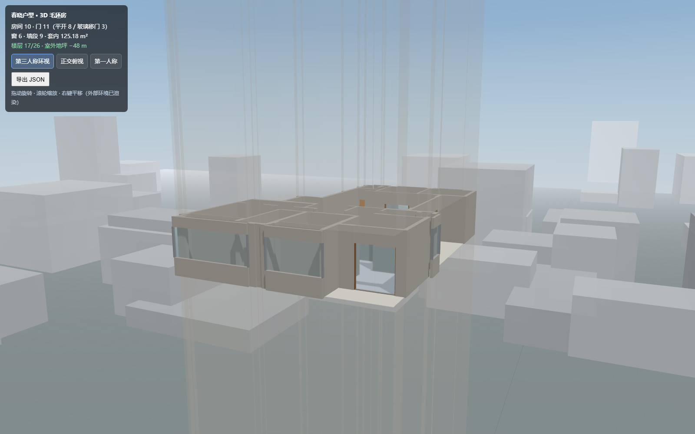
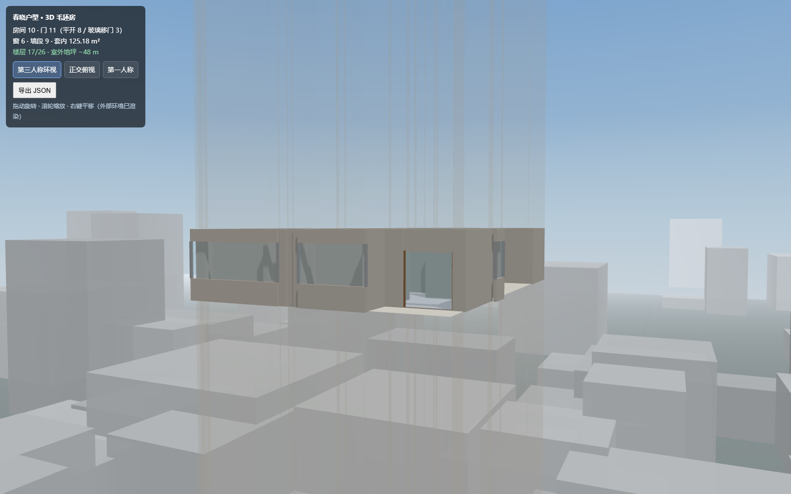

# 春晓户型 · 矢量 PDF → 3D 毛坯房

把 CAD 导出的**矢量 PDF 平面图**重建为一间**严格正交**的可交互 3D 毛坯房，
并且每一步都留下**可复核的中间产物**（数据 + 判读图），而不是"出个模型就完事"。


## 它解决什么

CAD 出的 PDF 保留了完整的 OCG 图层语义（`P-WALL` / `P-DOOR` / `COMM-GLAZ-SECT` …），
但这些图元**不能直接当几何用**：

- 门扇符号画在**开启位置**，当墙用就会在房间里切出一条**假墙**；
- 柱墙层的**斜向填充线**会把"严格正交"的户型污染成满屏斜边；
- 飘窗与房间之间只有**窗台边线**，不是墙；公卫旁的**管井**不是可用空间；
- 窗户 / 阳台的玻璃移门与平开门混在同一图层，得靠**图元形态**区分。

本项目逐个把这些坑填掉，并把**判读歧义处的裁定**显式写进代码
（`pipeline/geom_v6.py` 顶部的「人工裁定表」，每条注明 PDF 依据）。

## 结果

| 指标 | 值 |
|------|-----|
| 房间 | 10 |
| 门 | 11（平开 8 + 玻璃移门 3） |
| 窗 | 6 |
| 套内面积 | 125.18 m² |
| 非轴向边 | **0**（不是"轴率 93%"） |

移门洞口**撑到墙端**（推拉门在图上是**半开**画的，门扇并集 ≠ 洞口）：
厨房 1.0 → **1.59 m**、客厅阳台 → 4.43 m、小孩房阳台 → 1.91 m。



## 快速开始

```bash
PY="C:/Users/super/.workbuddy/binaries/python/envs/default/Scripts/python.exe"   # 换成你的解释器

$PY pipeline/geom_v6.py            # 1. 重建 room-graph / walls_poly / roof_poly
$PY pipeline/triangulate_walls.py  # 2. 墙体 CDT 预三角化
$PY pipeline/make_plan6.py full    # 3. 出「理解平面图」（full|master|gw）

cd app && npm install && npx vite  # 4. 打开 3D
```

## 三个视角

默认是**第三人称环视**（透视轨道相机，拖动旋转 / 滚轮缩放 / 右键平移）：

| 视角 | 参数 | 用途 |
|------|------|------|
| 第三人称环视（默认） | `?mode=orbit` · `?az=` 方位角 · `?el=` 仰角 · `?dist=` 取景 | 看体量、看高度、看外部环境 |
| 正交俯视 | `?mode=top` · `?zoom=` · `?cx=&cy=` · `?tilt=`（>0 轴测） | 读图纸、量尺寸、截图判读 |
| 第一人称漫游 | `?mode=walk` | 进屋走（WASD + 指针锁定） |

兼容旧链接：只带 `?tilt=`/`?zoom=`/`?cx=`/`?cy=` 时自动按正交俯视处理。

## 外部环境（17/26 层）

套型按 **17/26 层**渲染，脚下 48 m 才是地坪：



- **天空穹顶**：顶点色渐变（零依赖，不引 shader），地平线有雾带
- **地坪 + 街道网格**：每格 5 m，给"多高"一个可量测的参照
- **两圈城市剪影**：近景矮楼 + 远景高楼，确定性伪随机（mulberry32，截图可复现）
- **半透明楼身**：地坪→本层 的楼身 + 本层→塔顶 的 9 层体量，一眼看出"在这么高"
- 俯视（图纸模式）下**自动关闭**，不干扰正交判读

> ⚠️ 环境是**程序化示意**，只表达"在 17 楼"，不代表真实周边城市（未接 GIS 数据）。

## 立即看 3D（不用装环境）

**方式一：单文件离线版（推荐，双击即开、可随便转发）**

`demo/chunxiao-3d-standalone.html` 把整个 3D 应用（React + three.js 全部内联）
压成**一个 0.96 MB 的 HTML**，双击用浏览器打开即可，不需要服务器、不需要联网。

```bash
$PY tools/build_standalone.py                 # 从 app/dist 重新打包
bash tools/verify_standalone.sh               # file:// 下真实渲染自检（像素方差判定）
```

**方式二：本地静态服务**

```bash
cd app && npx vite build                        # 产物落在 app/dist
python -m http.server 5180 --bind 127.0.0.1 -d app/dist
# 打开 http://127.0.0.1:5180/（同样支持 ?tilt=55 等参数）
```

## 管线

```
chunxiao.pdf
   │
   ├─[1] 墙掩膜        P-WALL / COMM-WALL / 柱墙层，**轴向过滤**（正交性的根本保证）
   ├─[2] 户型包络      结构外皮 → 1D 核形态学闭合 → 填外轮廓（剔除邻户/公摊）
   ├─[3] 洞口反推      门扇 bbox 四侧探针扫墙 → 洞口线段；玻璃剖线 → 窗
   ├─[4] 房间分割      free = (barrier==0) & (envelope>0) → 连通域 → 贴旧房间名
   ├─[5] 矢量化        CHAIN_APPROX_NONE + 对角阶梯 L 形展开（边数 1020 → 368）
   └─[6] 写盘          room-graph.json / walls_poly.json / roof_poly.json
```

再经 `triangulate_walls.py` 做 Shewchuk CDT，前端顶面走三角网、侧壁走轮廓拉伸，
**绕开 three.js 的 earcut**（它在极瘦凹多边形上会产出穿透墙体的黑三角）。

## 判读可视化（不只是出模型）

| 工具 | 用途 |
|------|------|
| `make_plan6.py` | 把**管线实际产出的数据**画到 PDF 底图上，每个房间标 id，用于人眼核对 |
| `probe_region2.py X0 Y0 X1 Y1` | 列出 ROI 内所有矢量图元（图层/颜色/几何），判读歧义处用 |
| `roi_pdf.py X0 Y0 X1 Y1 [scale]` | 渲染 ROI 原图并按图层语义高亮（`PLAIN=1` 看原图） |
| `diag_gw_cut.py` | 把墙 ∪ 封堵条与房间连通域放大重绘，定位"房间被切"的元凶 |

## 前端

Vite + React + react-three-fiber。

- 墙体：CDT 三角网顶面 + 轮廓侧壁
- 门：`swing`（门扇 + 把手 + 门楣，开向读 `door.side`）/ `glazing`（多扇错开玻璃推拉门，
  **铺满整个洞口**）/ `lift` / `opening`
- 窗：窗台墙 + 玻璃 + 窗楣三段
- 飘窗：`room.bays` → 0.5m 抬高台面
- 视角：第三人称轨道（默认）/ 正交俯视 / 第一人称漫游；`?debug=wall|door|floor` 单层诊断
- 环境：天空穹顶 + 地坪网格 + 城市剪影 + 半透明楼身（按 17/26 层定位）
- 主光 `SunLight` 的 target 跟到套型中心，阴影正交框才框得住（原先默认在世界原点，影子被裁）

## 目录

```
assets/chunxiao.pdf     矢量 PDF（管线主源）
pipeline/               全部 Python 管线与诊断工具
app/                    Vite + React + r3f 前端
demo/                   单文件离线演示页（构建产物）
tools/capture.sh        截图（起 vite + headless Edge CDP，单张）
tools/shots.sh          多视角连拍（一次启动，拍 N 张）
tools/build_standalone.py  把 app/dist 打成单文件 HTML
tools/verify_standalone.sh file:// 渲染自检
data/v6/                中间图与理解图
RUN-LOG.md              逐轮工作日志（含每个坑的根因与修法）
AGENTS.md               协作约定与人工裁定表
```
